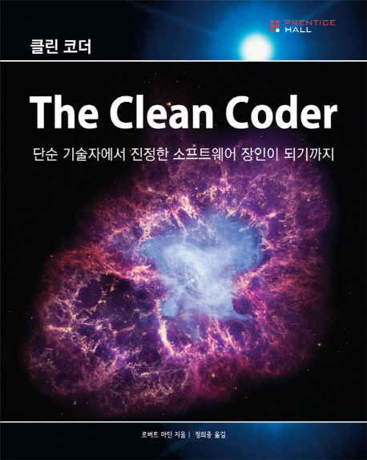

이 책은 멘토링 모임에서 추천하는 책이기도 하고 밥 아저씨라는 로버트 마틴의 저서이기에
더 관심을 갖게 되어 읽게 되었다.

처음에 책을 느낌으로 봤을때는 좀 더 전문적인 얘기를 하는 내용이라고 생각 했으나,
읽어보니 오랜기간 이 분야에서 일하며 배운 자신의 경험을 바탕으로 우리에게 안내해주는
안내서 같은 느낌이었다. 그래서 읽으면서 마치 소설책을 읽는 것 처럼 느껴지는 부분도 많았고
이 글을 쓰고 있는 나도 일하며 일어나고 느끼는 상황들에서 공감 되는 부분이 많아서
정말 재밌게 읽었다.

특히 2, 3장에서 아니라고 말하기, 예라고 말하기 부분이 와닿았다. 나도 일하다보면 다른팀이나
고객이 일정에 대해 물을때가 있다. 그럴때 고객이나 다른팀의 요청에 어쩔 수 없이 수긍할때가 있고
그들의 요구에 충족을 못해 줬을때 내가 약해 보인다는 느낌에 어쩔수 없이 예나 아니오를 할때가
있다. 그래서 2, 3장을 보면서 프로라면 좀 더 확실하게 정확하게 판단하여 되는 것과 안되는 것
어디까지 되고 어디까지 안되고 하는 것들을 그들이 최선으로 선택할 수 있게 확실하게 해야한다는 걸
배웠다.

자신의 경험을 바탕으로 안내하는 책이라 그런지 일하며 느낀 부분에서 공감 되는 부분이 많았다.
그러한 부분을 대화형식으로 진행해가며 설명하는 것이 좀 더 이해가 쉽게 되었다.
고객이 요구하는 부분을 이야기 하고 우리가 거기에 맞게 개발을 함에도 불구하고 만들면 변경되는
부분이 정말 많은데 그 부분에서 정말 공감을 했다. 그래서 인수테스트 등이 왜 필요하고 어떻게
마음가짐을 가져야 하는지를 깨닫게 되었다. 

그래서 이 책은 일하면서 일어나는 상황에서 프로의 마음가짐을 잘 배울 수 있는 책이다.
필요한 부분을 앞으로도 꾸준히 찾아봐야겠다.